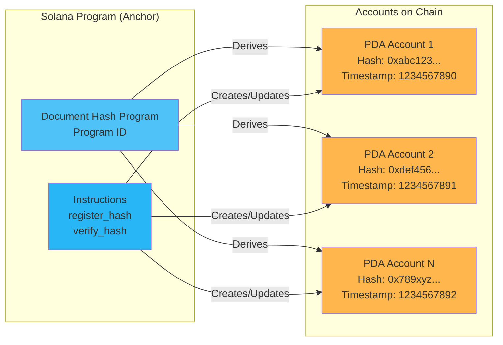
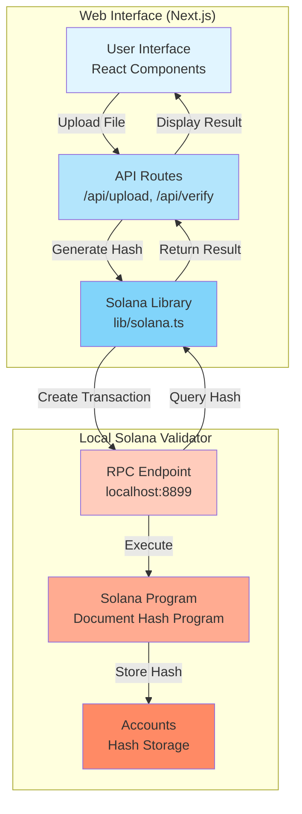
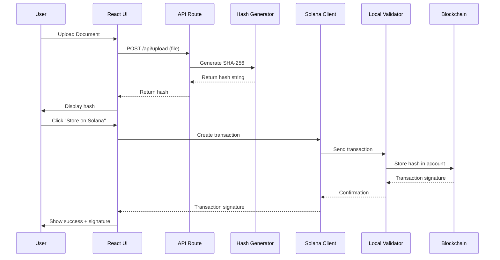
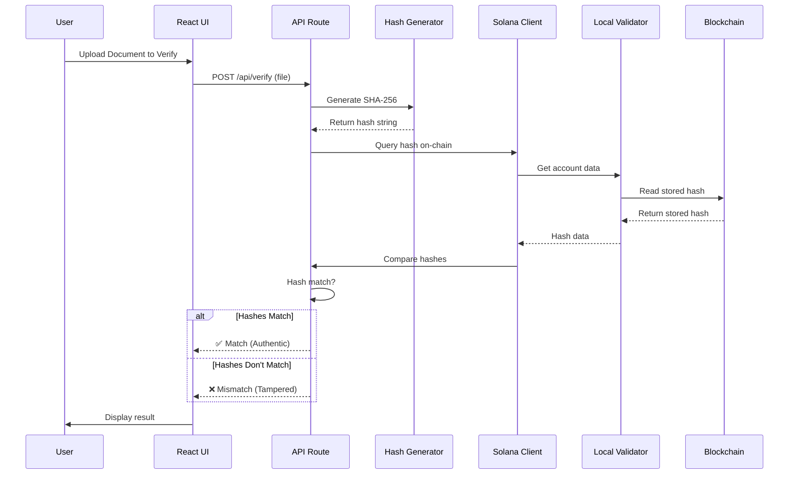

# PRD: Document Hash Verification Demo

## Overview

A simple web app demo that shows how to:

- Upload a document and generate a SHA-256 hash
- Store the hash on a **local Solana node**
- Verify documents by comparing hashes on-chain

**Purpose**: Demonstrate coding with Cursor AI and Solana blockchain development.

## Core Features (Demo Scope)

### 1. Document Upload & Hash

- Upload a PDF or image file
- Generate SHA-256 hash
- Display hash to user

### 2. Store Hash on Solana

- Connect to local Solana validator
- Create transaction to store hash
- Show transaction signature

### 3. Verify Document

- Upload a document
- Generate hash
- Check if hash exists on-chain
- Show match/mismatch result

## Tech Stack

### Frontend

- **Next.js** (React framework)
- **TypeScript**
- **Tailwind CSS** (styling)
- **@solana/web3.js** (Solana SDK)
- **No wallet adapter needed** - use keypair directly for demo simplicity

### Backend

- **Next.js API routes** (no separate backend needed)
- **Node.js crypto** (SHA-256 hashing)
- **Multer** (file upload handling)

### Blockchain

- **Local Solana Validator** (solana-test-validator)
- **Anchor framework** (optional, for Solana program)
- Or simple account-based storage

## Demo Simplifications

### Why No Wallet Adapter?

For a **live coding demo**, we're skipping the wallet connector and using a keypair directly. Here's why:

**Wallet Adapter Challenges:**

- ❌ Requires users to install browser extension (Phantom, etc.)
- ❌ Connection can fail during demo (network issues, extension not installed)
- ❌ More complex setup (provider configuration, context providers)
- ❌ Can break flow if wallet disconnects mid-demo

**Keypair Approach Benefits:**

- ✅ **Zero setup** - works immediately
- ✅ **More reliable** - no external dependencies
- ✅ **Faster to code** - fewer moving parts
- ✅ **Still demonstrates Solana** - shows transactions, accounts, blockchain storage
- ✅ **Perfect for local validator** - unlimited SOL, instant transactions

**When to use wallet adapter:**

- Production apps that need real user wallets
- Apps deployed to mainnet/devnet
- When you specifically want to demo wallet integration

For this demo, the keypair approach lets you focus on **Solana concepts** rather than **wallet setup complexity**.

## Project Structure

```
/
├── app/                    # Next.js app directory
│   ├── page.tsx           # Main upload page
│   ├── verify/            # Verification page
│   └── api/
│       ├── upload/        # File upload endpoint
│       ├── hash/          # Hash generation endpoint
│       └── verify/        # Verification endpoint
├── components/
│   ├── FileUpload.tsx
│   ├── HashDisplay.tsx
│   └── StoreButton.tsx
├── lib/
│   ├── solana.ts          # Solana connection & transactions
│   └── hash.ts            # Hash generation utilities
├── programs/               # Solana program (if using Anchor)
│   └── document-hash/
└── package.json
```

## Implementation Steps

### Step 1: Setup Local Solana Node

```bash
# Install Solana CLI
sh -c "$(curl -sSfL https://release.solana.com/stable/install)"

# Start local validator
solana-test-validator
```

### Step 2: Create Next.js App

```bash
npx create-next-app@latest document-verifier --typescript --tailwind
cd document-verifier
npm install @solana/web3.js multer
```

**Note**: We're skipping wallet adapter for demo simplicity. We'll use a keypair directly instead.

### Step 3: Build Core Features

1. **File Upload Component**

   - Drag & drop interface
   - File validation (PDF, PNG, JPG)
   - Max 10MB

2. **Hash Generation**

   - Use Node.js `crypto.createHash('sha256')`
   - Display hash as hex string

3. **Solana Integration**

   - Connect to `http://localhost:8899` (local validator)
   - Generate a keypair (or use existing) for signing transactions
   - Airdrop SOL to keypair (local validator has unlimited SOL)
   - Create account to store hash
   - Store hash as account data

   **Why no wallet adapter?** For a demo, using a keypair directly is:

   - ✅ Simpler setup (no wallet extension needed)
   - ✅ More reliable (no connection issues)
   - ✅ Faster to code (fewer dependencies)
   - ✅ Still demonstrates Solana concepts perfectly

4. **Verification**
   - Query account data from Solana
   - Compare hashes
   - Show result

## Simple Solana Storage Approach

For demo simplicity, we can:

- Create a new account for each hash
- Store hash (32 bytes) in account data
- Use account address as the "verification ID"

Or use a simple Anchor program:

- Single program account that stores multiple hashes
- PDA (Program Derived Address) per hash

### Solana Program Structure



**Note**: Each PDA is derived from the program ID and the hash value, ensuring one account per unique hash.

## System Architecture



## UI Mockup (Simple)

```
┌─────────────────────────────────────┐
│  Document Hash Verifier            │
├─────────────────────────────────────┤
│                                     │
│  [Upload Document]                  │
│  Drag & drop or click to upload    │
│                                     │
│  Hash: abc123...                    │
│  [Copy]                             │
│                                     │
│  [Store on Solana]                  │
│  (Uses keypair - no wallet needed) │
│                                     │
│  Transaction: 5j7s8...              │
│  ✅ Stored successfully!            │
│                                     │
│  ───────────────────────────────    │
│                                     │
│  [Verify Document]                  │
│  Upload document to verify          │
│                                     │
│  Result: ✅ Match / ❌ Mismatch     │
│                                     │
└─────────────────────────────────────┘
```

## Demo Flow

1. **Start local Solana validator** in terminal (`solana-test-validator`)
2. **Start Next.js app** (`npm run dev`)
3. **Upload a document** → see hash generated
4. **Click "Store on Solana"** → automatically uses keypair (no wallet needed!)
5. **See transaction signature** → hash is now on-chain
6. **Upload same document** → verify → ✅ Match
7. **Modify document** → verify → ❌ Mismatch

**No wallet extension needed!** The app uses a keypair directly, making the demo smoother and more reliable.

## Data Flow Diagrams

### Document Registration Flow



### Document Verification Flow



## Key Code Snippets to Demonstrate

### Hash Generation

```typescript
import crypto from "crypto";

function generateHash(fileBuffer: Buffer): string {
  return crypto.createHash("sha256").update(fileBuffer).digest("hex");
}
```

### Solana Connection & Keypair Setup

```typescript
import { Connection, Keypair, SystemProgram } from "@solana/web3.js";
import bs58 from "bs58"; // npm install bs58

// Connect to local validator
const connection = new Connection("http://localhost:8899", "confirmed");

// Generate or reuse a keypair for signing
// Option 1: Generate new keypair
const payer = Keypair.generate();

// Option 2: Use existing keypair from env (for demo consistency)
// const payer = Keypair.fromSecretKey(bs58.decode(process.env.PAYER_SECRET_KEY!));

// Airdrop SOL (local validator has unlimited)
await connection.requestAirdrop(payer.publicKey, 2 * 1_000_000_000); // 2 SOL
await connection.confirmTransaction(await connection.getLatestBlockhash());
```

### Store Hash on Chain

```typescript
// Create new account to store hash
const hashAccount = Keypair.generate();
const hashBuffer = Buffer.from(hash, "hex");

// Create account transaction
const transaction = new Transaction().add(
  SystemProgram.createAccount({
    fromPubkey: payer.publicKey,
    newAccountPubkey: hashAccount.publicKey,
    lamports: await connection.getMinimumBalanceForRentExemption(32),
    space: 32, // 32 bytes for hash
    programId: SystemProgram.programId,
  })
);

// Sign and send
transaction.sign(payer, hashAccount);
const signature = await connection.sendTransaction(transaction, [
  payer,
  hashAccount,
]);
await connection.confirmTransaction(signature);

console.log("Hash stored! Account:", hashAccount.publicKey.toString());
```

## What Makes This Demo Cool

1. **Visual Feedback**: See hash generation in real-time
2. **Blockchain Integration**: Actual on-chain storage (local)
3. **Practical Use Case**: Document tampering detection
4. **Full Stack**: Frontend + Backend + Blockchain
5. **Easy to Modify**: Show how to change hash when document changes

## Next Steps After Demo

- Add metadata (document name, date)
- Support multiple documents
- Add transaction history
- Deploy to Solana Devnet
- **Optional**: Add wallet adapter (Phantom, Solflare) for production use
  - Only if you want to show real wallet integration
  - For demo, keypair approach is simpler and more reliable

---

**Goal**: Build a working demo in 1-2 hours that showcases Cursor AI coding and Solana development.
