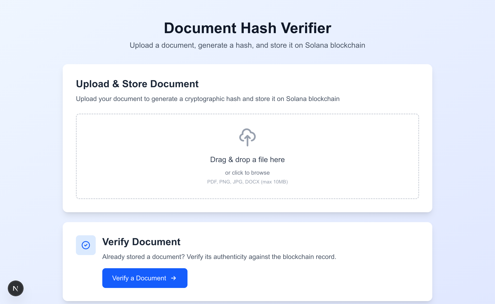
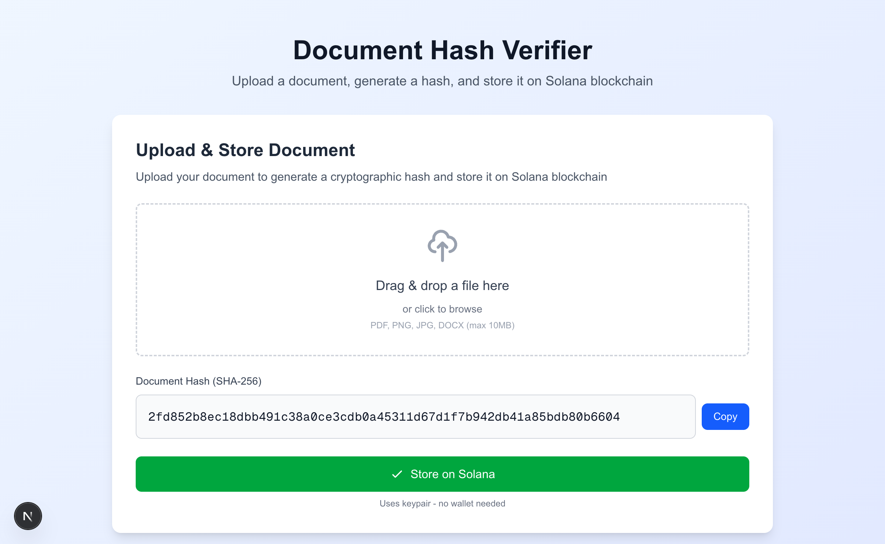
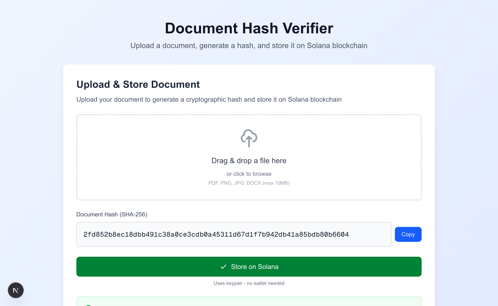
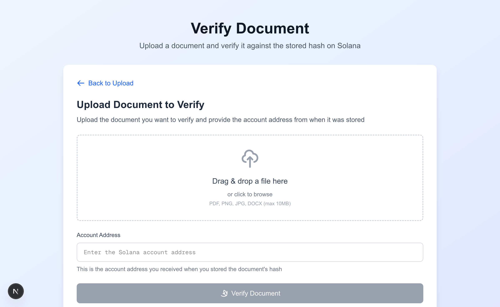

# 📄 Document Hash Verifier

A blockchain-based document verification system built with **Next.js** and **Solana**. This application allows you to generate cryptographic hashes of documents and store them immutably on the Solana blockchain for future verification.

## 🎥 Watch the Build Session

Watch the full coding session where this project was built from scratch:

**[▶️ Watch on YouTube: Building a Document Verifier on Solana Blockchain](https://youtu.be/QVc3J0_TwWw)**



## 🌟 Features

- **📤 Document Upload**: Drag-and-drop or browse to upload documents (PDF, PNG, JPG, DOCX)
- **🔐 SHA-256 Hashing**: Generates cryptographically secure hashes of your documents
- **⛓️ Blockchain Storage**: Stores document hashes on Solana for immutable record-keeping
- **✅ Document Verification**: Verify document authenticity against blockchain records
- **🎨 Modern UI**: Beautiful, responsive interface built with Tailwind CSS
- **⚡ Real-time Feedback**: Loading states, success/error messages, and visual feedback

## 🎯 Use Cases

- **Educational Credentials**: Verify authenticity of degrees and certificates
- **Legal Documents**: Ensure contracts haven't been tampered with
- **Medical Records**: Verify integrity of patient records
- **Intellectual Property**: Timestamp and prove ownership of documents
- **Supply Chain**: Authenticate product documentation

## 🚀 Getting Started

### Prerequisites

- **Node.js** (v18 or higher)
- **npm** or **yarn**
- **Solana CLI** (for local development)

### Installation

1. **Clone the repository**

```bash
git clone <your-repo-url>
cd document-verifier
```

2. **Install dependencies**

```bash
npm install
```

3. **Install Solana CLI** (if not already installed)

For macOS (using Homebrew):

```bash
brew install solana
```

For Linux/macOS (using official installer):

```bash
sh -c "$(curl -sSfL https://release.solana.com/stable/install)"
```

4. **Start the local Solana test validator**

```bash
solana-test-validator
```

Keep this running in a separate terminal window.

5. **Start the development server**

```bash
npm run dev
```

6. **Open your browser**
   Navigate to [http://localhost:3000](http://localhost:3000)

## 📖 How to Use

### Storing a Document Hash

1. **Upload Your Document**
   - Drag and drop a file or click to browse
   - Supported formats: PDF, PNG, JPG, DOCX (max 10MB)



2. **Generate Hash**

   - The application automatically generates a SHA-256 hash of your document

3. **Store on Blockchain**
   - Click "Store on Solana" to save the hash to the blockchain
   - You'll receive an account address and transaction signature



4. **Save the Account Address**
   - Copy and save the account address - you'll need it to verify the document later

### Verifying a Document

1. **Navigate to Verification Page**
   - Click "Verify a Document" from the home page



2. **Upload Document to Verify**

   - Upload the document you want to verify

3. **Enter Account Address**

   - Paste the account address you received when storing the hash

4. **Verify**
   - Click "Verify Document"
   - The system will compare the document's hash with the blockchain record
   - ✅ **Match**: Document is authentic and unchanged
   - ❌ **Mismatch**: Document has been modified or is not the original

## 🏗️ Architecture

### Tech Stack

- **Frontend**: Next.js 14 (App Router), React, TypeScript
- **Styling**: Tailwind CSS
- **Blockchain**: Solana (@solana/web3.js)
- **Hashing**: Node.js crypto module (SHA-256)
- **File Upload**: Multer

### Project Structure

```
document-verifier/
├── app/
│   ├── api/
│   │   ├── upload/          # File upload & hash generation
│   │   ├── store/           # Store hash on Solana
│   │   └── verify/          # Verify document against blockchain
│   ├── verify/              # Verification page
│   └── page.tsx             # Home page
├── components/
│   ├── FileUpload.tsx       # Drag-and-drop file upload
│   ├── HashDisplay.tsx      # Display generated hash
│   ├── StoreButton.tsx      # Store hash on blockchain
│   └── VerifyResult.tsx     # Display verification results
├── lib/
│   ├── hash.ts              # SHA-256 hashing utilities
│   └── solana.ts            # Solana blockchain interactions
└── public/
    └── screenshots/         # Application screenshots
```

## 🔧 Configuration

### Solana Network

By default, the application connects to `http://localhost:8899` (local test validator).

To change the network, update the connection in `lib/solana.ts`:

```typescript
const SOLANA_RPC_URL =
  process.env.NEXT_PUBLIC_SOLANA_RPC_URL || "http://localhost:8899";
```

### File Upload Limits

- **Max file size**: 10MB
- **Supported formats**: PDF, PNG, JPG, DOCX

To modify these limits, update `components/FileUpload.tsx` and `app/api/upload/route.ts`.

## 🛡️ Security Considerations

### For Production Use

This demo application uses a keypair for signing transactions. **For production**, consider:

1. **Wallet Integration**: Use Solana wallet adapters (Phantom, Solflare, etc.)
2. **Network Security**: Use Solana mainnet or devnet
3. **API Security**: Add authentication and rate limiting
4. **Input Validation**: Enhanced file type and content validation
5. **HTTPS**: Use secure connections
6. **Audit**: Security audit of smart contracts

### Current Demo Setup

- Uses local Solana test validator
- Keypair-based transaction signing
- File-based hash storage (for demo persistence)
- No authentication or user accounts

## 🔍 How It Works

1. **Hash Generation**: When a document is uploaded, the server generates a SHA-256 hash of its contents. This creates a unique "fingerprint" of the document.

2. **Blockchain Storage**: The hash is stored in a new Solana account. The account address serves as a unique identifier for this document record.

3. **Verification**: To verify a document, the system:

   - Generates the hash of the uploaded document
   - Retrieves the stored hash from the blockchain using the account address
   - Compares the two hashes
   - Returns whether they match (authentic) or not (tampered/different document)

4. **Immutability**: Once stored on the blockchain, the hash cannot be modified or deleted, providing a permanent, tamper-proof record.

## 📝 API Endpoints

### POST `/api/upload`

Upload a file and generate its SHA-256 hash.

**Request**: `multipart/form-data` with file

**Response**:

```json
{
  "hash": "2fd852b8ec18dbb491c38a0ce3cdb0a45311d67d1f7b942db41a85bdb80b6604"
}
```

### POST `/api/store`

Store a hash on the Solana blockchain.

**Request**:

```json
{
  "hash": "2fd852b8ec18dbb491c38a0ce3cdb0a45311d67d1f7b942db41a85bdb80b6604"
}
```

**Response**:

```json
{
  "account": "9YG6W486MfYBHAYvvCPadp3SamX5LMFPYKRYnKSeqphv",
  "signature": "5az4V6cqyBcUEWaAoKG2AG2PGe3BMeqbeq2ic9E3sqW7..."
}
```

### POST `/api/verify`

Verify a document against a stored hash.

**Request**: `multipart/form-data` with file and accountAddress

**Response**:

```json
{
  "match": true,
  "message": "Document is authentic",
  "hash": "2fd852b8ec18dbb491c38a0ce3cdb0a45311d67d1f7b942db41a85bdb80b6604",
  "accountAddress": "9YG6W486MfYBHAYvvCPadp3SamX5LMFPYKRYnKSeqphv"
}
```

## 🧪 Development

### Running Tests

```bash
npm test
```

### Building for Production

```bash
npm run build
npm start
```

### Linting

```bash
npm run lint
```

## 🤝 Contributing

Contributions are welcome! Please feel free to submit a Pull Request.

## 📜 License

This project is open source and available under the [MIT License](LICENSE).

## 🔗 Resources

- [Solana Documentation](https://docs.solana.com/)
- [Next.js Documentation](https://nextjs.org/docs)
- [SHA-256 Hash Function](https://en.wikipedia.org/wiki/SHA-2)
- [Web3.js Documentation](https://solana-labs.github.io/solana-web3.js/)

## 💡 Future Enhancements

- [ ] Wallet adapter integration (Phantom, Solflare)
- [ ] Batch document verification
- [ ] Document history tracking
- [ ] Email notifications
- [ ] API key management
- [ ] Advanced analytics dashboard
- [ ] Mobile app version
- [ ] Multi-language support

## 🐛 Troubleshooting

### Solana validator not starting

```bash
# Reset the validator
solana-test-validator --reset
```

### "Failed to generate hash" error

- Ensure file size is under 10MB
- Check file format is supported
- Verify Node.js version is 18+

### "Failed to store hash" error

- Ensure Solana test validator is running
- Check connection to localhost:8899
- Verify sufficient SOL in the keypair account

## 📞 Support

For issues, questions, or suggestions, please open an issue on GitHub.

---

**Built with ❤️ using Next.js and Solana**
